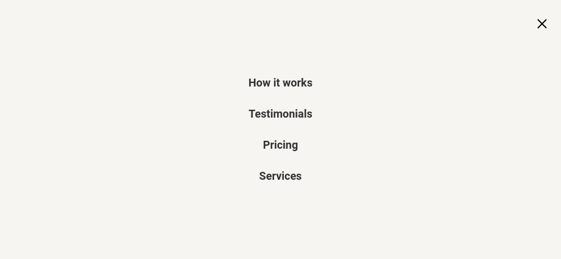
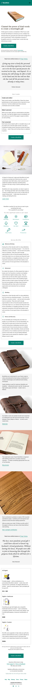
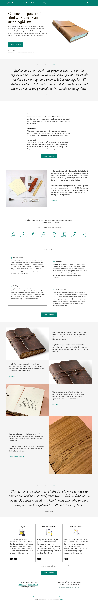

# 🔗 Bondfolio

#### A book that allows you to channel the power of kind words to create a meaningful gift

## About Bondfolio
It feels good to receive a compliment. What if you could recreate that feeling for someone you love, multiply it by everyone they love, and pack all of that warm energy into a one-of-a-kind book? That’s a Bondfolio-a bounty of thoughtful words for a mutual friend—words that may otherwise go unsaid. 

### Public Gallery
12 photos including price images

# 🔗 Bondfolio

#### A book that allows you to channel the power of kind words to create a meaningful gift

## About Bondfolio
It feels good to receive a compliment. What if you could recreate that feeling for someone you love, multiply it by everyone they love, and pack all of that warm energy into a one-of-a-kind book? That’s a Bondfolio-a bounty of thoughtful words for a mutual friend—words that may otherwise go unsaid. 

### Public Gallery
12 photos including price images

### Section
* header
* Hero
* Testimonials
* How it works
* Features
* Services
* Pricing
* CTA
* Footer


## Screenshots
navigation

mobile

desktop



## Technologies used
* VITE


## Installation

git clone project or download

```bash
 git clone https://github.com/lebohangmdm/bondfolio.git
```

Navigate to repository:

```bash
 cd ./bondfolio
```

Install the dependencies
```bash
 npm install
```

Start the development Sever:
```bash
 npm run dev
```

